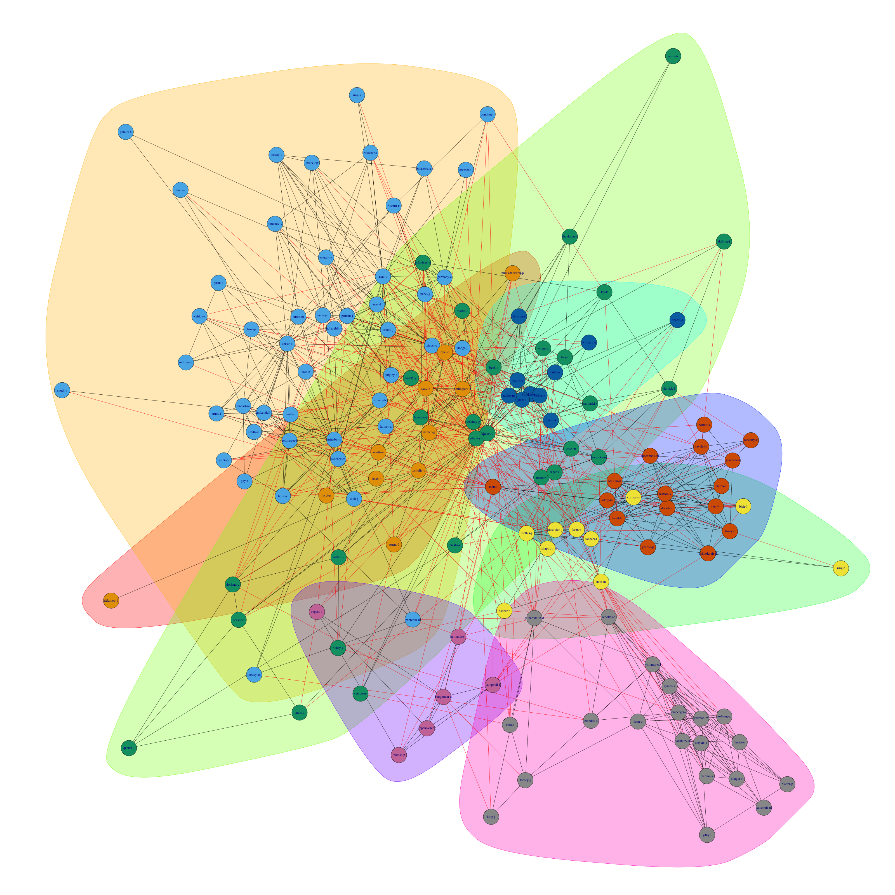
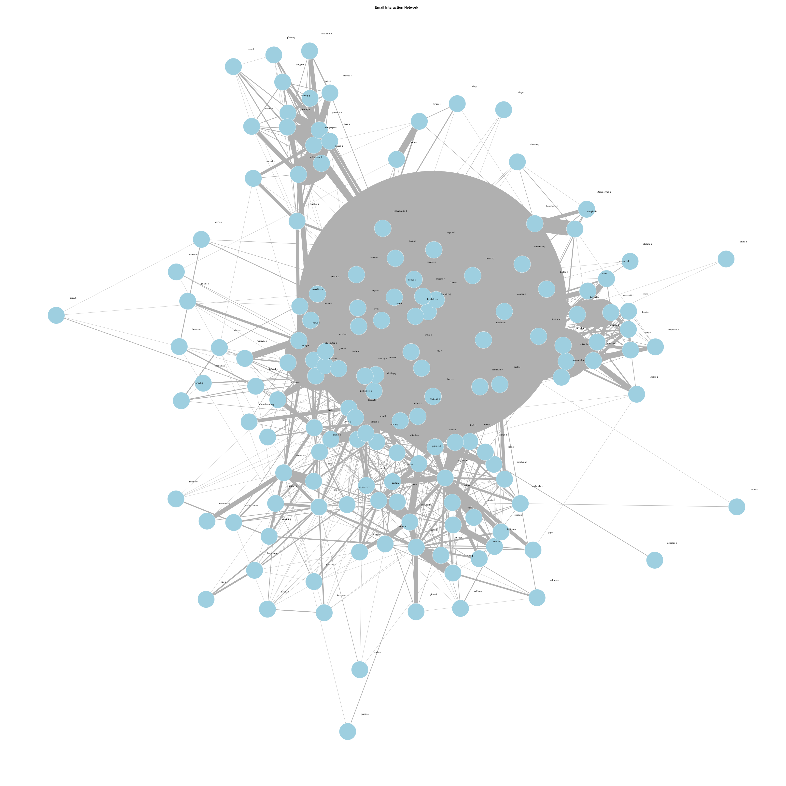

```{r setup, include=FALSE}
knitr::opts_chunk$set(echo = TRUE)
library(rstudioapi)
library(stringr)
library(dplyr)
library(purrr)
library(ggplot2)
library(igraph)
library(reshape2)
```

This notebook tries to provide a one-click-runs-all codes for data loading, processing, EDA, clusters and figure plotting.

## Data Loading and Processing

The folder structure of this project should be like:

```         
├── (Your name for the project folder)
    ├── Dockerfile
    ├── README.md
    ├── data
    │   ├── Introducing_the_Enron_Corpus.pdf
    │   ├── enron_mail_20150507
    │   │   └── maildir
    │   ├── enron_mail_20150507.tar.gz
    │   └── klimt-ecml04.pdf
    ├── figures
    │   ├── cluster1_network.png
    │   ├── email_all_cluster.png
    │   ├── email_all_network.png
    │   ├── email_inbox_cluster.png
    │   └── email_inbox_network.png
    ├── final_project.Rmd
    ├── final_project.html
    ├── notebooks
    │   ├── experiments.Rmd
    │   └── experiments.html
    ├── results
    │   ├── dfs.Rdata
    │   └── users.Rdata
    └── scripts
        ├── Cluster.R
        ├── Generate_Users.R
        ├── README.md
        ├── classify_email_type.R
        ├── data_classify.R
        ├── data_loading.R
        ├── download_enron.R
        ├── extract_cluster.R
        └── new_data_classify.R
```

**Make sure the folders are correctly structured as above for reproducibility concerns!**

```{r}
# set the paths and working directory
notebook_path <- rstudioapi::getActiveDocumentContext()$path 
mother_path <- dirname(dirname(notebook_path))

# set the path for the project, data, scripts, etc.
Sys.setenv(mother_path = mother_path)
script_path <- paste0(mother_path, "/scripts")
data_path <- paste0(mother_path, "/data")
results_path <- paste0(mother_path, "/results")
notebook_path <- paste0(mother_path, "/notebooks")
```

Now download the data (if needed) and load all the data we need for further investigation. If you want to load the data by yourself or using different filters, please check the `/scripts/data_loading.R` for customized operations.

```{r}
# detect if the data is already downloaded, if not, then download and untar it.
if (!file.exists(paste0(data_path, "/enron_mail_20150507"))) {
    message("No dataset detected, start downloading, please wait patiently.")
    source(paste0(script_path, "/download_enron.R"))
    download_data()
  }

# load all the data we need for analyses
load(paste0(results_path, "/dfs.Rdata")) 
load(paste0(results_path, "/users.Rdata"))
```

Before we look into the data, we first clarify two maybe confusing concepts:

-   `name`: the folder name of a user, for example, allen-p or causholli-m.

-   `mailname`: the name(s) that a user would use in his email address (excluding the domain name "\@enron.com"), for example, allen-p has both "phillip.allen" and "k..allen" as his mailnames.

Using these two concepts, we make a simple explanation on the content of the dataframes and the way to get them:

-   `users`: the dataframe containing all the active users' `name`, `mailname` and the absolute path to their folder.

-   `inboxes.within.fromto.df`: the dataframe contains the from and to `name` of the emails extracted from all users' **inboxes**.

-   `all.within.fromto.df` : the dataframe contains all the from and to `name` of the emails extracted from all users' **all email folders**.

The data loading and processing procedure for `all.within.fromto.df` is as following:

1.  List all the mail files' paths and form a dataframe.

2.  Read the From lines of the emails, extract only the emails sent by users within company. Use the user's `name` as To, and form a dataframe containing all the From and To information.

3.  Create the `users` dataframe by extracting all the `mailname`s they use, and match the list with their `name`.

4.  Filter all the emails which From and To users are both within the company (i.e. included in the `users`).

**REMARK**: There is a sub-folder in the "/sent_items/" folder in pereira-s named "clickathome", after checking the only email's content in it (an advertisement), we choose to remove it from our investigation.

## Exploratory Data Analysis

We conduct EDA on both inbox mail data and all mail data. For both dataset, we plot some exploratory figures to see if there are clear patterns or interesting trends.

### Inbox mails

First we plot histograms of the number of emails every user sent/received.

```{r echo=FALSE}
# make histograms of all the receivers and senders
hist_sent <- ggplot(inboxes.within.fromto.df, aes(x = from)) +
  geom_bar() +
  labs(title = "Inbox emails sent within company", x = 'Sent by:') +
  theme(axis.text.x = element_text(angle = 45, hjust = 1))

hist_received <- ggplot(inboxes.within.fromto.df, aes(x = to)) +
  geom_bar() +
  labs(title = "Inbox emails received within company", x = 'Sent to:') +
  theme(axis.text.x = element_text(angle = 45, hjust = 1))

plot(hist_received)
plot(hist_sent)
```

We also plot a figure for the number filtered by 50, just for better visualization.

```{r}
# make plots for filtered data
filtered_sent <- inboxes.within.fromto.df %>%
  group_by(from) %>%
  filter(n() >= 50) %>%
  mutate(num_from = n()) %>%
  ungroup() %>%
  mutate(from = factor(from, levels = names(sort(table(from), decreasing = TRUE))))
  

hist_sent <- ggplot(filtered_sent, aes(x = from)) +
  geom_bar() +
  labs(title = "Inbox emails sent within company (>=50)", x = 'Sent by:') +
  theme(axis.text.x = element_text(angle = 45, hjust = 1))

filtered_receive <- inboxes.within.fromto.df %>%
  group_by(to) %>%
  filter(n() >= 50) %>%
  mutate(num_to = n()) %>%
  ungroup() %>%
  mutate(to = factor(to, levels = names(sort(table(to), decreasing = T))))

hist_received <- ggplot(filtered_receive, aes(x = to)) +
  geom_bar() +
  labs(title = "Inbox emails received within company(>=50)", x = 'Sent to:') +
  theme(axis.text.x = element_text(angle = 45, hjust = 1))

plot(hist_received)
plot(hist_sent)
```

It is quite interesting that, grigsby-m, the one who sent the most emails to others' inboxes does not even show up in the filtered figure of inbox email received. From some outside source, we know that grigsby-m is actually titled as VP Trading, ENA Gas West. No wonder he would send tons of emails to other users. Now we cross-check some of the busiest inbox users:

```{r}
common_users <- intersect(filtered_sent$from, filtered_receive$to)
print(common_users)
```

Among them, tycholiz-b is VP Trading, ENA Gas West, shackleton-s is VP ENA & Senior Counsel, dasovich-j is Dir State Government Affairs, heard-m is Specialist Legal. Most of these high-frequency users are actually the ones managing groups of people.

Also, we check the mail clusters and social network plots using a Fruchterman-Reingold (FR) layout.

> Force-directed layouts try to get a nice-looking graph where edges are similar in length and cross each other as little as possible. They simulate the graph as a physical system. Nodes are electrically charged particles that repulse each other when they get too close. The edges act as springs that attract connected nodes closer together. As a result, nodes are evenly distributed through the chart area, and the layout is intuitive in that **nodes which share more connections are closer to each other**.

**Need to notice that, the distances between nodes are not meaningful (they do not necessarily measure the "distance" of two users).**

```{r, warning=FALSE, message=FALSE}
set.seed(321)
# Get the unique senders and recipients
all_names <- unique(c(inboxes.within.fromto.df$from, inboxes.within.fromto.df$to))

# Create a contingency table with a predefined set of row and column names
mail_count_table <- table(factor(inboxes.within.fromto.df$from, levels = all_names), factor(inboxes.within.fromto.df$to, levels = all_names))

# print(table_inboxes_from_to_within)

mail_count_df <- melt(mail_count_table)

# Create a heatmap using ggplot2
ggplot(mail_count_df, aes(x = Var1, y = Var2, fill = log(value+1))) +
  geom_tile() +
  scale_fill_gradient(low = "white", high = "blue") +
  labs(title = "Email Interaction Heatmap (log(count)+1)", x = "From", y = "To", fill = "Count") +
  scale_x_discrete(breaks = levels(mail_count_df$Var1)[seq(1, length(levels(mail_count_df$Var1)), by = 5)]) +
  scale_y_discrete(breaks = levels(mail_count_df$Var2)[seq(1, length(levels(mail_count_df$Var2)), by = 5)]) +
  theme(axis.text.x = element_text(angle = 45, hjust = 1),
        axis.text.y = element_text(hjust = 1))

# Create a graph from the matrix
graph <- graph_from_adjacency_matrix(mail_count_table, mode = "undirected", weighted = TRUE, diag = FALSE)
# Filter edges with low weight (e.g., below a threshold)
# graph <- delete_edges(graph, E(graph)[weight < 5])
community <- cluster_louvain(graph)
png(paste0(mother_path, "/figures/email_inbox_cluster.png"), width=3200, height = 3200)
plot(community, graph, vertex.size=4)
dev.off()

layout <- layout_with_fr(graph)  # Fruchterman-Reingold layout (often better for clarity)
png(paste0(mother_path, "/figures/email_inbox_network.png"), width = 3200, height = 3200)  # Width and height in pixels


# Plot the network graph with adjustments
plot(graph, 
     vertex.size = 5,         # Larger nodes
     vertex.label.cex = 0.8,  # Adjust text size
     edge.width = E(graph)$weight,  # Edge width based on the weight (email count)
     layout = layout,         # Use the new layout for better node spacing
     main = "Email Interaction Network",
     vertex.label.color = "black", # Change label color for contrast
     vertex.color = "lightblue",  # Node color
     edge.arrow.size = 0.5,   # Adjust arrow size on edges
     edge.color = "gray",     # Edge color
     vertex.label.dist = 1,   # Distance between label and node
     vertex.frame.color = "white")  # Frame color around nodes

# Close the PNG device (save the plot)
dev.off()
```


In the inbox cluster/network figure, it seems that causholli-m forms a single cluster herself. Let's check what happened to causholli-m?

```{r}
causholli_inbox <- inboxes.within.fromto.df %>%
  filter(to == 'causholli-m')

causholli_inbox
```

It is just one email she sent herself, and that's why she is forming an isolated group. This also enlightens us, considering only the inbox mails is far from enough!!

------------------------------------------------------------------------

**From now on, we focus on all the emails within the enron company**:

We also make the same histograms to view the top senders/receivers:

```{r echo=FALSE}
# filter the mails
filtered_sent <- all.within.fromto.df %>%
  group_by(from) %>%
  filter(n() >= 300) %>%
  mutate(num_from = n()) %>%
  ungroup() %>%
  mutate(from = factor(from, levels = names(sort(table(from), decreasing = TRUE))))

hist_sent <- ggplot(filtered_sent, aes(x = from)) +
  geom_bar() +
  labs(title = "histogram of all emails sent within company (>=200)", x = 'Sent by:') +
  theme(axis.text.x = element_text(angle = 45, hjust = 1))

filtered_receive <- all.within.fromto.df %>%
  group_by(to) %>%
  filter(n() >= 200) %>%
  mutate(num_to = n()) %>%
  ungroup() %>%
  mutate(to = factor(to, levels = names(sort(table(to), decreasing = TRUE))))

hist_received <- ggplot(filtered_receive, aes(x = to)) +
  geom_bar() +
  labs(title = "histogram of all emails received within company(>=300)", x = 'Sent to:') +
  theme(axis.text.x = element_text(angle = 45, hjust = 1))

plot(hist_received)
plot(hist_sent)
```

```{r}
common_users <- intersect(filtered_sent$from, filtered_receive$to)
print(common_users)
```

The results are quite convincing when we consider all the mails within the users. The highest in both From and To, is Kay Mann (mann-k), who was the head of legal for Enron. The fact that she sent so many emails is ironical, seeing as how Enron was breaking every law in the book. Besides, some of the newly-added users are germany-c, Capacity Trader, jones-t, Senior Legal Specialist, scott-s, Assistant Trader and sager-e, VP & Assistant General Counsel.

We also plot the clusters and network using all the email sending/receiving information.

```{r}
set.seed(123)
# Get the unique senders and recipients
all_names <- unique(c(all.within.fromto.df$from, all.within.fromto.df$to))

# Create a contingency table with a predefined set of row and column names
mail_count_table <- table(factor(all.within.fromto.df$from, levels = all_names), factor(all.within.fromto.df$to, levels = all_names))

# print(table_inboxes_from_to_within)

mail_count_df <- melt(mail_count_table)

# Create a heatmap using ggplot2
ggplot(mail_count_df, aes(x = Var1, y = Var2, fill = log(value+1))) +
  geom_tile() +
  scale_fill_gradient(low = "white", high = "blue") +
  labs(title = "Email Interaction Heatmap", x = "From", y = "To", fill="log(count+1)") +
  scale_x_discrete(breaks = levels(mail_count_df$Var1)[seq(1, length(levels(mail_count_df$Var1)), by = 5)]) +
  scale_y_discrete(breaks = levels(mail_count_df$Var2)[seq(1, length(levels(mail_count_df$Var2)), by = 5)]) +
  theme(axis.text.x = element_text(angle = 45, hjust = 1),
        axis.text.y = element_text(hjust = 1))

# Create a graph from the matrix
graph <- graph_from_adjacency_matrix(mail_count_table, mode = "undirected", weighted = TRUE, diag = FALSE)
# Filter edges with low weight (e.g., below a threshold)
# graph <- delete_edges(graph, E(graph)[weight < 5])
community <- cluster_louvain(graph)
png(paste0(mother_path, "/figures/email_all_cluster.png"), width=3200, height = 3200)
plot(community, graph, vertex.size=4)
dev.off()

layout <- layout_with_fr(graph)  # Fruchterman-Reingold layout (often better for clarity)
png(paste0(mother_path, "/figures/email_all_network.png"), width = 3200, height = 3200)  # Width and height in pixels


# Plot the network graph with adjustments
plot(graph, 
     vertex.size = 5,        # Larger nodes
     vertex.label.cex = 0.8,  # Adjust text size
     edge.width = E(graph)$weight,  # Edge width based on the weight (email count)
     layout = layout,         # Use the new layout for better node spacing
     main = "Email Interaction Network",
     vertex.label.color = "black", # Change label color for contrast
     vertex.color = "lightblue",  # Node color
     edge.arrow.size = 0.5,   # Adjust arrow size on edges
     edge.color = "gray",     # Edge color
     vertex.label.dist = 1,   # Distance between label and node
     vertex.frame.color = "white")  # Frame color around nodes

# Close the PNG device (save the plot)
dev.off()
```





## Semantic Analysis

load("semantic analysis result.Rdata") load("xxx .Rdata")

### Communities under different types of emails

Since the cluster algorithm has randomness in it (the louvain cluster algorithm starts from random initial points), we run the algorithm multiple times and catch the cluster with top modularity scores.

```{r}
source(paste0(mother_path, "/scripts/Cluster.R"))

collected_clusters_df <- data.frame(matrix(nrow=0, ncol=2))
colnames(collected_clusters_df) <- c('cluster', 'score')

for (i in seq(30)){
  top_three_df <- get_top_three(matrix = all.within.fromto.df)
  collected_clusters_df <- rbind(collected_clusters_df, top_three_df)
}

collected_clusters_df$score <- as.numeric(unlist(collected_clusters_df$score))

top_clusters <- collected_clusters_df %>%
  group_by(cluster) %>%
  summarise(avg_score = mean(score, na.rm = TRUE))
```

```{r}
head(top_clusters$cluster,3)
top_clusters[1:3, 2]
```

```{R, include=FALSE}
# get the membership information
membership(community)
target_community <- 10
target_nodes_1 <- V(graph)$name[membership(community) == target_community]
#print(target_nodes)  # Display the nodes in the target community

cluster1 <- users[users$name %in% target_nodes_1, ]

target_community <- 9
target_nodes_2 <- V(graph)$name[membership(community) == target_community]
# print(target_nodes)  # Display the nodes in the target community

cluster2 <- users[users$name %in% target_nodes_2, ]

c1.within.df <- all.within.fromto.df %>%
  filter(from %in% cluster1$name) %>%
  filter(to %in% cluster1$name)

c2.within.df <- all.within.fromto.df %>%
  filter(from %in% cluster2$name) %>%
  filter(to %in% cluster2$name)

c1.filtered.df <- c1.within.df %>%
  filter(from != to)
c1_count_table <- table(factor(c1.filtered.df$from, levels = target_nodes_1), factor(c1.filtered.df$to, levels=target_nodes_1))
c1_count_table

c2.filtered.df <- c2.within.df %>%
  filter(from != to)
c2_count_table <- table(factor(c2.filtered.df$from, levels = target_nodes_2), factor(c2.filtered.df$to, levels=target_nodes_2))
c2_count_table

graph <- graph_from_adjacency_matrix(c2_count_table, mode = "directed", weighted = TRUE, diag = FALSE)
layout <- layout_with_fr(graph)
png(paste0(mother_path, "/figures/cluster1_network.png"), height = 3200, width = 3200)
plot(graph, vertex.size=5)
dev.off
```
